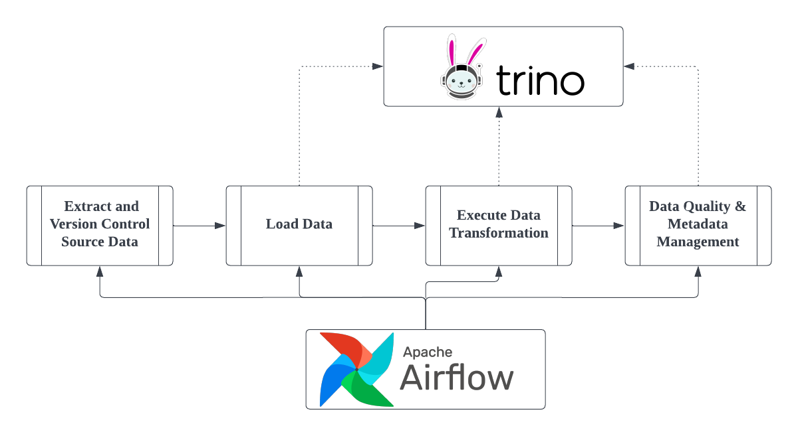

# OS-Climate Data Commons Developer Guide: Data Ingestion Pipeline Overview

OS-Climate Data Commons provides a backbone for building, maintaining and operating data pipelines at scale. Our data ingestion pipelines are structured following an Extraction Loading Transformation (ELT) patterns with key steps represented in the diagram below.

The key steps are as follows:

- A data ingestion trigger is used to create an instance of Directed Acyclic Graph (DAG) in Airflow. A DAG is a collection of tasks organized with dependencies and relationships to say how the ingestion should run. Note that as per our principle of Data as Code, the schema of the DAG as well as the code blueprint of all tasks are maintained in a source code repository.
- The ingestion flow always starts with the validation of source data which is a check for minimum data requirements as well as ingestion format. Once the source data is validated, data is either federated (if accessible directly to our data federation layer) or extracted and put under version control.
- The next step is loading of the data into cloud storage for further processing, leveraging Trino as an ingestion engine. This is required again only in the case where data needs to be extracted from source.
- From the versioned data source, the transformation pipeline is then triggered. At this stage all transformations are done as repetable and versioned SQL code leveraging DBT.
- Finally, the generation of data set metadata as well as execution of data validation checks are done are performed, and the resulting metadata and quality control results loaded into our metadata catalogue together with the data lineage of the pipeline.

In the above process, all data, metadata, and data quality checks are automatically documented and made available in the Data Commons layer as a new version-controlled data set. Any exception in the data ingestion pipeline or, if the ingestion is successful, a report on the data ingestion and processing including results of quality tests are generated and sent to the data owner. This approach allows to easily and transparently correct erroneous data inputs and trigger re-processing as required, since the resulting data load is provided and made accessible to the data owner even in case the data quality level is not good enough for distribution.

Next, we will go through the various steps of a data pipeline with code examples. For this, we will use an ingestion example from our [WRI Global Power Plant Database ingestion pipeline repository](https://github.com/os-climate/wri-gppd-ingestion-pipeline), which show the ingestion process from file-based source data into a dedicated Trino schema as well as all the steps required for data quality and metadata management.

## Next Step

[Data Extraction](./data-extraction.md)
